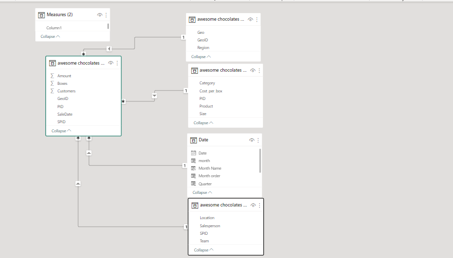
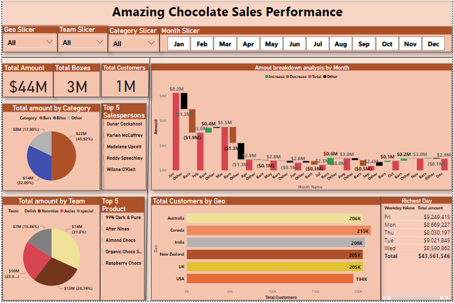

# Amazing-Chocolate-sale-Analysis

In this project, I analyzed and explored dataset with SQL using Mysql Server And PowerBi. I wrangled the data to find insights and patterns like which product sold the most and what date.
As the Data Analyst, I was directed by the CMO of Amazing Chocolate company, a fictitious manufacturing company to analyze the sales  data of the company . He wants to keep an eye on the company’s Internal performance 
The company, Amazing Chocaolate, manufactures expensive Chocolate products that could be eaten by adults and childeren and it sells them directly to consumers nationwide as well as several other countries. 

## Datasets Overview

1. Github: This contains all the images used in this project

2. Read.me: This is the introductry part of the project. it provides all the information of the project.

3. Awesome.chocolate-data.sql: This is the raw data code for the project. This should be imported directly to sql server.

4. Chocolate sql quaery: It contains all the project SQL queries. It provides to all the business questions.
 
## To gather insights on how the company is performing as regards to sales and market share, I was directed to provide answers to the following questions;

1. Provide details of shipments (sales) where amounts are > 2,000 and Boxes are < 100
2. How many shipments (sales) each of the salespersons had in the month of january 2022?
3. Which product sells more boxes? Milk Bars Or Eclair?
4. Whivh product sold more boxes in the first 7 days of February 2022? Milk Bars or Eclairs?
5. Which shipments had under 100 customers and Under 100 boxes? Did any of them occur on wednesday?
6. What are the names of salespersons who had at least one shipment (sales) in the first 7 days of January 2022?
7. Which salesperson did not makes any shipments in the first 7 days of January 2022?
8. How many times did we ship more than 1000 boxes in each month?
9. Did we ship at least one box of "After nines" to 'new zealand'on all the months?
10. India or Australia? who buys more chocolate boxes on a monthly basis 

## The processes I took in other to provide answers to the above questions are:
* I was provided a CSV sql file which i uploaded direct to MySql server.
* Then I used that same file for powerBi Analyze.
* Cleaned the data using Power Query and merging necessary tables to overcome ambuguity.

  
  
* Created relationships; data modeling 
* Wrote few DAX to answer questions 
* Designed my dashboard with the reports and most important metrics.

## Dashboard Report
Here is a PowerBi Dashboard report that i buildt to further visualize the insights and trends derived from this analysis.

 
 
 ## Summary of Findings
 
 According to the inisghts derived from the sales data:
 * The total amount generated is $43,561,546
 * The catergory that generated the most revenue is Bars at  $21,746,501, which is 49.92% of the entire revenue
 * Majority of the products did well as over 2 million was generated by most of the post, however the product that generated the most revenue is After Nine, which is      %2,112,502 and has the rate of 4.8& of the entire revenue.
 * I found out that the day will the most revenue is Friday, as $9,249,415.
 * Canada has the highest number of customers, over 215k.  at a rate of 17.42%.
 * The breakdown Analysis, the company experienced  sale decrease as their revenue dropped drastically by the year. The revenue genrated Jan was $82,238,111 an it went    down gradually to $2,940,049.
 
 

